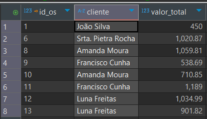
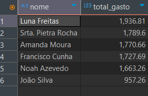
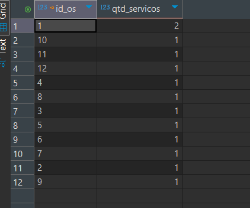
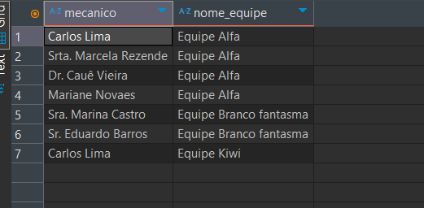

# 🚗 Banco de Dados para Oficina Mecânica 🔧

## 📌 Descrição do Projeto

Este projeto apresenta um modelo completo de banco de dados relacional para uma oficina mecânica. O objetivo é gerenciar de forma eficiente informações como clientes, veículos, ordens de serviço, mecânicos, peças, pagamentos e equipes. A modelagem foi realizada utilizando o MySQL e ferramentas como o MySQL Workbench e DBeaver.

---

## 📊 Estrutura do Banco de Dados

O banco foi modelado com base no modelo EER (Enhanced Entity-Relationship) e convertido para o modelo lógico relacional. Abaixo estão as principais entidades:

### 🧑‍💼 Clientes
- `id_cliente` (PK): Identificador único
- `nome`, `email`, `endereco`, `contato`

### 🚘 Veículos
- `id_veiculo` (PK), `placa`, `modelo`, `marca`, `ano`
- `id_cliente` (FK): proprietário do veículo

### 🛠️ Mecânicos
- `id_mecanico` (PK), `nome`, `endereco`, `especialidade`

### 👥 Equipe de Mecânicos
- `id_equipe` (PK), `nome_equipe`

### 🔗 Mecanicos_Equipe (N:M)
- Relaciona mecânicos a suas respectivas equipes

### 📄 Ordem de Serviço
- `id_os` (PK), `data_emissao`, `data_entrega`, `status`, `valor_total`
- `id_veiculo` (FK), `id_equipe` (FK)

### 🏷️ Serviços
- `id_servico` (PK), `descricao`, `valor_referencia`

### 🔄 OS_Servicos (N:M)
- Relaciona ordens aos serviços prestados

### 🔩 Peças
- `id_peca` (PK), `descricao`, `valor`

### 🔗 OS_Pecas (N:M)
- Relaciona ordens às peças utilizadas

### 💳 Pagamentos
- `id_pagamento` (PK), `forma_pagamento`, `valor_pago`, `id_os` (FK)

---

## 🔄 Relacionamentos

- Cliente ⇨ Veículo (1:N)
- Veículo ⇨ Ordem de Serviço (1:N)
- Equipe ⇨ Ordem de Serviço (1:N)
- Mecânico ⇄ Equipe (N:M)
- Ordem ⇄ Serviços (N:M)
- Ordem ⇄ Peças (N:M)
- Ordem ⇨ Pagamentos (1:N)

---

## 🧪 Execução e Testes

### 🔹 Requisitos
- MySQL 8+
- DBeaver ou MySQL Workbench

### 🔹 Como Executar
1. Crie a database:
   ```sql
   CREATE DATABASE oficina;
   ```
2. Execute os arquivos na ordem:
   - `schema_logico.sql`
   - `dados_teste.sql`
   - `consultas_avancadas.sql`

---

## 📌 Consultas Exemplares

### 🔎 Ordens de serviço finalizadas e em andamento:


### 💰 Total gasto por cliente:


### 📦 Quantidade de serviços por OS:


### 👥 Relação de mecânicos e suas equipes:


---

## 💻 Tecnologias Utilizadas

- MySQL
- SQL padrão ANSI
- DBeaver
- MySQL Workbench

---

## 👤 Autor

Desenvolvido por [**Paula Alessandra Rodrigues dos Santos**](https://www.linkedin.com/in/paulaalessandrars/)  
🎓 Projeto acadêmico de modelagem e implementação de banco de dados relacional  
📫 Para contato, [clique aqui ](mailto:paulaalessandra_rodrigues@outlook.com)  para enviar um e-mail ou visite meu [LinkedIn](https://www.linkedin.com/in/paulaalessandrars/)


---

## 🪪 Licença

Este projeto é livre para uso educacional e não possui fins comerciais.
